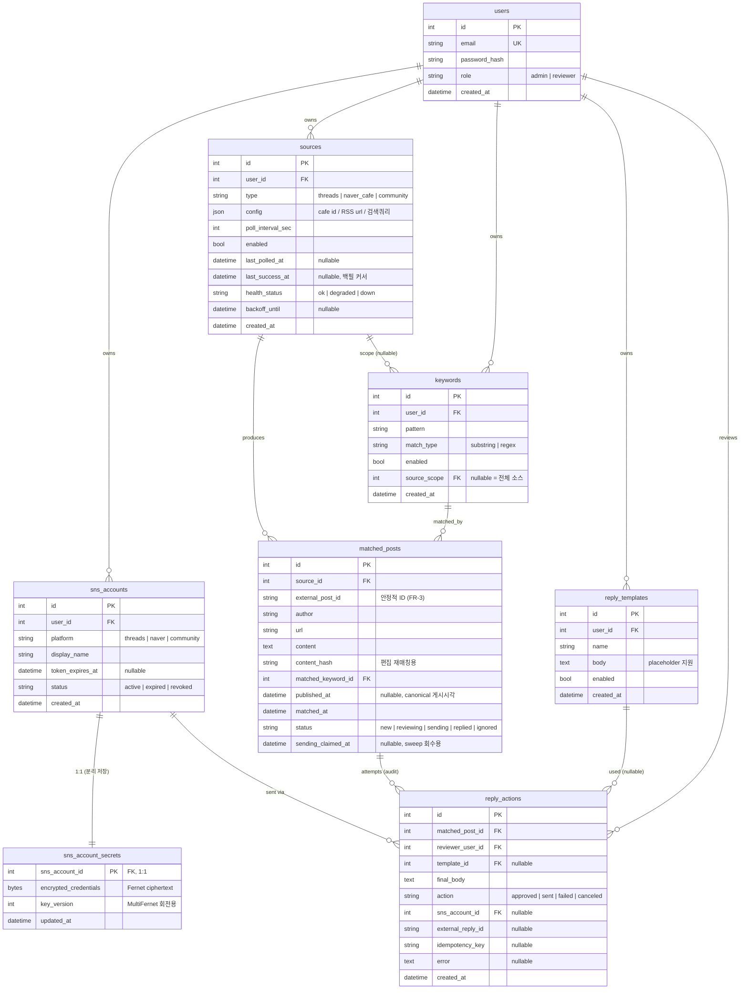

# ERD — 데이터 모델

> PRD 기반. Tortoise ORM + Postgres. 8개 테이블(핵심 7 + 자격증명 분리 1).
> 최종 갱신: 2026-07-08 · Status: pending approval

---

## 다이어그램



---

## 인덱스 & 제약 (핵심)

| 테이블 | 제약/인덱스 | 목적 |
|---|---|---|
| users | `UNIQUE(email)` | 로그인 식별 |
| sns_account_secrets | PK=`sns_account_id`, **read path 미로드** | 토큰 구조적 배제 (MUST-FIX #3) |
| sources | `INDEX(enabled, backoff_until)` | poller 픽업 대상 조회 |
| matched_posts | **`UNIQUE(source_id, external_post_id)`** | 인바운드 dedup (FR-2) |
| matched_posts | `INDEX(status)`, `INDEX(source_id, matched_at)` | 대시보드 필터 |
| reply_actions | **`UNIQUE(matched_post_id) WHERE action='sent'`** (partial) | 이중발송 구조적 차단 (MUST-FIX #1) |
| reply_actions | `INDEX(matched_post_id)` | 감사 조회 |

---

## 상태 전이 (matched_posts.status)

```
new ──(reviewer 열람)──▶ reviewing ──(승인 CAS)──▶ sending ──┬─(성공)─▶ replied
 │                          ▲                        │        └─(실패)─▶ reviewing (+failed reply_action, 수동 재시도)
 │                          └────(sweep, >N분 정체)──┘
 └──(무시)──▶ ignored
```

- **CAS 클레임 (MUST-FIX #1):** `UPDATE matched_posts SET status='sending', sending_claimed_at=now() WHERE id=$1 AND status IN ('new','reviewing') RETURNING id` — 0행이면 abort.
- **정체 회수 (MUST-FIX #4):** `sending_claimed_at` 초과 시 sweep이 `reviewing`으로 복귀.

---

## 설계 노트

- **자격증명 분리:** `sns_account_secrets`는 1:1 별도 테이블. 어떤 read 스키마도 이 테이블을 join/load하지 않으므로 직렬화기가 물리적으로 암호문에 접근 불가.
- **content_hash:** 편집된 글 재매칭(NICE-TO-HAVE). MVP는 저장만, 재매칭 로직은 후속.
- **published_at:** `external_post_id` 해시 입력의 canonical timestamp 출처(FR-3). null인 소스는 hash에서 timestamp 제외.
- **JSON config:** 소스 타입별 이질적 설정을 유연하게. 스키마는 어댑터가 검증.
